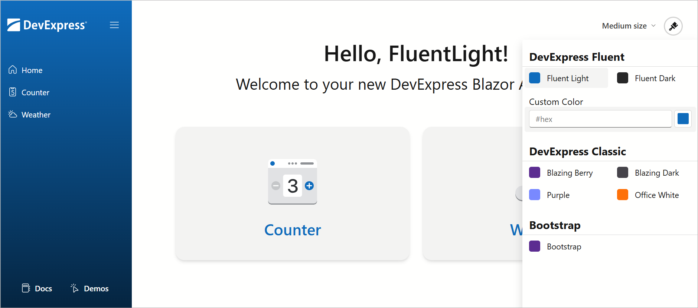

# Switch Themes and Size Modes in Blazor Applications at Runtime


This example demonstrates adds a Theme Switcher to your Blazor application. Users can switch between DevExpress Fluent and Classic themes, and external Bootstrap themes. This example uses the [DxResourceManager.RegisterTheme(ITheme)](https://docs.devexpress.com/Blazor/DevExpress.Blazor.DxResourceManager.RegisterTheme(DevExpress.Blazor.ITheme)) method to apply a theme at application startup and the [IThemeChangeService.SetTheme()](https://docs.devexpress.com/Blazor/DevExpress.Blazor.IThemeChangeService.SetTheme(DevExpress.Blazor.ITheme)) method to change the theme at runtime.

This example also implements a size mode combobox that allows users to switch between small, medium, and large [size modes](https://docs.devexpress.com/Blazor/401784/styling-and-themes/size-modes).



## Add Resources and Services

To implement custom theme and size mode switchers, configure your Blazor application as follows:

1. Copy the example [switcher-resources](./CS/switcher/switcher/wwwroot/switcher-resources) folder to your application *wwwroot* folder. The *switcher-resources* folder has the following structure:

    * **js/cookies-manager.js**  
    Contains a function that stores the theme in a cookie variable.
    * **js/size-manager.js**  
    Contains a function that assigns selected size mode to the `--global-size` CSS variable.
    * **theme-switcher.css**  
    Contains CSS rules that define theme switcher appearance and behavior.

2. Add the following services to your application (copy the corresponding files from the [Services](./CS/switcher/switcher/Services) folder):

    * [ThemesService.cs](./CS/switcher/switcher/Services/ThemesService.cs)  
    Implements the [IThemeChangeService](https://docs.devexpress.com/Blazor/DevExpress.Blazor.IThemeChangeService) interface to switch themes at runtime and uses the [SetTheme()](https://docs.devexpress.com/Blazor/DevExpress.Blazor.IThemeChangeService.SetTheme(DevExpress.Blazor.ITheme)) method to apply the selected theme. Supports custom accent colors for Fluent themes.
    * [Themes.cs](./CS/switcher/switcher/Services/Themes.cs)  
    Creates a list of themes for the theme switcher via the built-in DevExpress Blazor [Themes](https://docs.devexpress.com/Blazor/DevExpress.Blazor.Themes) collection and the [Clone()](https://docs.devexpress.com/Blazor/DevExpress.Blazor.DxThemeBase-1.Clone(System.Action--0-)) method.
    * [CookiesService.cs](./CS/switcher/switcher/Services/CookiesService.cs)  
    Manages cookies.
    * [SizeManager.cs](./CS/switcher/switcher/Services/SizeManager.cs) *(Optional)*  
    Manages application [size mode](https://docs.devexpress.com/Blazor/401784/styling-and-themes/size-modes) (small, medium, or large).

3. In the [_Imports.razor](./CS/switcher/switcher/Components/_Imports.razor) file, register `{ProjectName}.Components.ThemeSwitcher` and `{ProjectName}.Services` namespaces:

    ```razor
    @using {ProjectName}.Components.ThemeSwitcher
    @using {ProjectName}.Services
    ```

4. Register services in the [Program.cs](./CS/switcher/switcher/Program.cs) file:

    ```cs
    builder.Services.AddDevExpressBlazor();
    builder.Services.AddMvc();
    builder.Services.AddHttpContextAccessor();
    builder.Services.AddScoped<ThemesService>();
    builder.Services.AddTransient<CookiesService>();
    builder.Services.AddScoped<SizeManager>();
    ```

## Configure Available Themes

The theme switcher includes the following themes:

* DevExpress Fluent (Light/Dark with custom accent color support)
* DevExpress Classic (Blazing Berry, Blazing Dark, Purple, and Office White)
* [Bootstrap External](https://cdn.jsdelivr.net/npm/bootstrap@5.3.3/dist/css/bootstrap.min.css)

Create a [Themes.cs](./CS/switcher/switcher/Services/Themes.cs) file and configure themes:

1. For Classic themes, choose a theme from the built-in DevExpress Blazor [Themes](https://docs.devexpress.com/Blazor/DevExpress.Blazor.Themes) collection and add custom stylesheets (using the [Clone()](https://docs.devexpress.com/Blazor/DevExpress.Blazor.DxThemeBase-1.Clone(System.Action--0-)) method):

    ```cs
    public static readonly ITheme BlazingBerry = Themes.BlazingBerry.Clone(props => {
        props.AddFilePaths("css/theme-bs.css");
    });
    public static readonly ITheme BlazingDark = Themes.BlazingDark.Clone(props => {
        props.AddFilePaths("css/theme-bs.css");
    });
    public static readonly ITheme Purple = Themes.Purple.Clone(props => {
        props.AddFilePaths("css/theme-bs.css");
    });
    public static readonly ITheme OfficeWhite = Themes.OfficeWhite.Clone(props => {
        props.AddFilePaths("css/theme-bs.css");
    });
    ```
1. For Fluent themes, call the [Clone()](https://docs.devexpress.com/Blazor/DevExpress.Blazor.DxThemeBase-1.Clone(System.Action--0-)) method to add theme stylesheets and change theme mode:

    ```cs
    public static ITheme FluentLight(string? accent = null) { 
        return Themes.Fluent.Clone(props => {
            props.Name = "FluentLight" + accent?.PadLeft(8);
            props.SetCustomAccentColor(accent);
            props.AddFilePaths("css/theme-fluent.css");
        });
    }
    public static ITheme FluentDark(string? accent = null) {
        return Themes.Fluent.Clone(props => {
            props.Name = "FluentDark" + accent?.PadLeft(8);
            props.SetCustomAccentColor(accent);
            props.Mode = ThemeMode.Dark;
            props.AddFilePaths("css/theme-fluent.css");
        });
    }
    ```
1. For Bootstrap themes, call the [Clone()](https://docs.devexpress.com/Blazor/DevExpress.Blazor.DxThemeBase-1.Clone(System.Action--0-)) method to add a Bootstrap theme stylesheet. Use the same approach if you want to apply your own stylesheets.

    ```cs
    public static readonly ITheme BootstrapDefault = Themes.BootstrapExternal.Clone(props => {
        props.Name = "Bootstrap";
        props.AddFilePaths("https://cdn.jsdelivr.net/npm/bootstrap@5.3.3/dist/css/bootstrap.min.css");
        props.AddFilePaths("css/theme-bs.css");
    });
    ```
1. Create a list of themes:


    ```cs
    public enum MyTheme {
        FluentLight,
        FluentDark,

        BlazingBerry,
        BlazingDark,
        Purple,
        OfficeWhite,

        Bootstrap
    }
    ```

### Use Custom Accent Colors in Fluent Themes

The theme switcher allows you to apply a Fluent theme with a custom accent color as follows:

* A masked input field used to enter hex color values
* A color picker for visual color selection

The theme is applied automatically when a user selects the color.

Review implementation details in the [ThemeSwitcherContainer.razor](./CS/switcher/switcher/Components/ThemeSwitcher/ThemeSwitcherContainer.razor) file.

### Add Custom Stylesheets to the Application (Apply Styles to Non-DevExpress UI Elements)

Our DevExpress Blazor themes affect DevExpress components only. To apply theme-specific styles to non-DevExpress elements or the entire application, add external stylesheets to the theme using its `AddFilePaths()` method:

> Bootstrap themes require external theme-specific stylesheets. Once you register a Bootstrap theme, call the `Clone()` method and add the stylesheet using theme properties.

```cs
public static readonly ITheme BootstrapDefault = Themes.BootstrapExternal.Clone(props => {
    props.Name = "Bootstrap";
    // Links a Bootstrap theme stylesheet
    props.AddFilePaths("https://cdn.jsdelivr.net/npm/bootstrap@5.3.3/dist/css/bootstrap.min.css");
    // Links a custom stylesheet
    props.AddFilePaths("css/theme-bs.css");
});
```

### Change Bootstrap Theme Color Modes

If you want to use dark Bootstrap themes, apply a `data-bs-theme` attribute to the root `<html>` element:

* `data-bs-theme="light"` for light themes
* `data-bs-theme="dark"` for dark themes

Refer to the following article for more information: [Color Modes](https://getbootstrap.com/docs/5.3/customize/color-modes/).

## Add a Theme Switcher to Your Application

Follow the steps below to add a theme switcher to your application:

1. Copy the [ThemeSwitcher](./CS/switcher/switcher/Components/ThemeSwitcher) folder to your project. The folder contains:
   * [ThemeSwitcher.razor](./CS/switcher/switcher/Components/ThemeSwitcher/ThemeSwitcher.razor) - The theme switcher button.
   * [ThemeSwitcherContainer.razor](./CS/switcher/switcher/Components/ThemeSwitcher/ThemeSwitcherContainer.razor) - The theme selection panel with all available themes.
   * [ThemeSwitcherItem.razor](./CS/switcher/switcher/Components/ThemeSwitcher/ThemeSwitcherItem.razor) - An individual theme item.

2. Add the following code to the [Components/App.razor](./CS/switcher/switcher/Components/App.razor) file:

    * Inject services with the [&#91;Inject&#93; attribute](https://learn.microsoft.com/en-us/dotnet/api/microsoft.aspnetcore.components.injectattribute):

        ```razor
        @using Microsoft.AspNetCore.Mvc.ViewFeatures
        @using DevExpress.Blazor
        @inject IHttpContextAccessor HttpContextAccessor
        @inject IFileVersionProvider FileVersionProvider
        @inject ThemesService ThemesService
        ```
    
    * Add script and stylesheet links to the file's `<head>` section and call the [DxResourceManager.RegisterTheme(ITheme)](https://docs.devexpress.com/Blazor/DevExpress.Blazor.DxResourceManager.RegisterTheme(DevExpress.Blazor.ITheme)) method to apply a theme on application startup:

        ```html
        <head>
            @* ... *@
            <script src=@AppendVersion("switcher-resources/js/cookies-manager.js")></script>
            <link href=@AppendVersion("switcher-resources/theme-switcher.css") rel="stylesheet" />

            @DxResourceManager.RegisterTheme(Theme)

            <link href=@AppendVersion("css/site.css") rel="stylesheet" />
            <HeadOutlet @rendermode="InteractiveServer" />
        </head>
        ```

    * Obtain the theme from cookies during component initialization:

        ```razor
        @code {
            private ITheme Theme;
            private string AppendVersion(string path) => FileVersionProvider.AddFileVersionToPath("/", path);

            protected override void OnInitialized() {
                Theme = ThemesService.GetThemeFromCookies(HttpContextAccessor);
            }
        }
        ```

3. Declare the theme switcher component in the [MainLayout.razor](./CS/switcher/switcher/Components/Layout/MainLayout.razor) file:

    ```razor
    <div class="nav-buttons-container">
        @* Navigation buttons *@
        <div style="margin-left:auto; display:flex">
            <ThemeSwitcher />
        </div>
    </div>
    ```

## Add a Size Mode Switcher

To change size modes at runtime, you must:

1. Copy the [SizeChanger.razor](/CS/switcher/switcher/Components/Layout/SizeChanger.razor) file to the [Components/Layout](/CS/switcher/switcher/Components/Layout/) folder. This file creates a size mode menu and injects the [SizeManager](./CS/switcher/switcher/Services/SizeManager.cs) service.

2. Reference the [size-manager.js](./CS/switcher/switcher/wwwroot/switcher-resources/js/size-manager.js) script in the `<head>` section of the [App.razor](./CS/switcher/switcher/Components/App.razor) file:

    ```html
    <head>
        @* ... *@
        <script src=@AppendVersion("switcher-resources/js/size-manager.js")></script>
        @* ... *@
    </head>
    ```

4. Use the `--global-size` CSS variable to define the font size application-wide:

    ```css
    html, body {
        /* ... */
        font-size: var(--global-size);
    }
    ```

5. Declare the size mode switcher component in the [MainLayout.razor](./CS/switcher/switcher/Components/Layout/MainLayout.razor) file:

    ```razor
    <div class="nav-buttons-container">
        @* Navigation buttons *@
        <div style="margin-left:auto; display:flex">
            <SizeChanger />
            <ThemeSwitcher />
        </div>
    </div>
    ```

## Files to Review

* [ThemeSwitcher](./CS/switcher/switcher/Components/ThemeSwitcher) (folder)
* [switcher-resources](./CS/switcher/switcher/wwwroot/switcher-resources) (folder)
* [Services](./CS/switcher/switcher/Services) (folder)
* [App.razor](./CS/switcher/switcher/Components/App.razor)
* [MainLayout.razor](./CS/switcher/switcher/Components/Layout/MainLayout.razor)
* [Program.cs](./CS/switcher/switcher/Program.cs)

## Documentation

* [Themes](https://docs.devexpress.com/Blazor/401523/common-concepts/themes)
* [Fluent Theme Customization (Accent Colors)](https://docs.devexpress.com/Blazor/405530/styling-and-themes/fluent-theme-customization)
* [Size Modes](https://docs.devexpress.com/Blazor/401784/styling-and-themes/size-modes)

<!-- feedback -->
## Does this example address your development requirements/objectives?

[](https://www.devexpress.com/support/examples/survey.xml?utm_source=github&utm_campaign=blazor-theme-switcher&~~~was_helpful=yes) [](https://www.devexpress.com/support/examples/survey.xml?utm_source=github&utm_campaign=blazor-theme-switcher&~~~was_helpful=no)

(you will be redirected to DevExpress.com to submit your response)
<!-- feedback end -->

