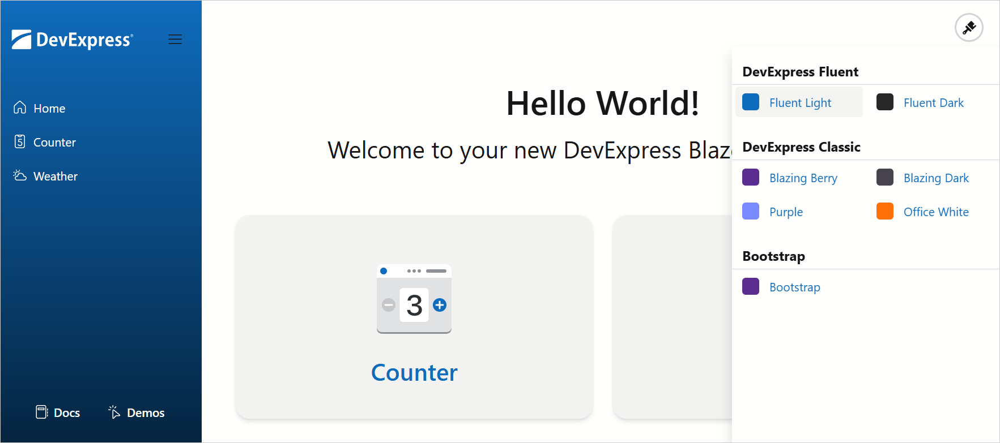

<!-- default badges list -->

[](https://supportcenter.devexpress.com/ticket/details/T845557)
[](https://docs.devexpress.com/GeneralInformation/403183)
[](#does-this-example-address-your-development-requirementsobjectives)
<!-- default badges end -->
# Implement a Theme Switcher in Blazor Applications

This example demonstrates how to add a Theme Switcher to your application. Users can switch between DevExpress Fluent and Classic themes and external Bootstrap themes. This example uses the [DxResourceManager.RegisterTheme(ITheme)](https://docs.devexpress.com/Blazor/DevExpress.Blazor.DxResourceManager.RegisterTheme(DevExpress.Blazor.ITheme)) method to apply a theme at application startup and the [IThemeChangeService.SetTheme()](https://docs.devexpress.com/Blazor/DevExpress.Blazor.IThemeChangeService.SetTheme(DevExpress.Blazor.ITheme)) method to change the theme at runtime.

This example also implements a size mode switcher. Users can switch between small, medium, and large [size modes](https://docs.devexpress.com/Blazor/401784/styling-and-themes/size-modes).




## Configure Available Themes

The theme switcher includes the following themes:

* DevExpress Fluent (Light Blue and Dark Blue)
* DevExpress Classic (Blazing Berry, Blazing Dark, Purple, and Office White)
* [Bootstrap External](https://cdn.jsdelivr.net/npm/bootstrap@5.3.3/dist/css/bootstrap.min.css)


Create a `Themes.cs` file and configure themes:


1. For Classic themes, choose a theme from the built-in DevExpress Blazor [Themes](https://docs.devexpress.com/Blazor/DevExpress.Blazor.Themes) collection:

    ```cs
    public static readonly ITheme BlazingBerry = Themes.BlazingBerry;
    public static readonly ITheme BlazingDark = Themes.BlazingDark;
    public static readonly ITheme Purple = Themes.Purple;
    public static readonly ITheme OfficeWhite = Themes.OfficeWhite;
    ```
1. For Fluent themes, call the [Clone()](https://docs.devexpress.com/Blazor/DevExpress.Blazor.DxThemeBase-1.Clone(System.Action--0-)) method to add theme stylesheets and change theme mode:

    ```cs
    public static readonly ITheme FluentLight = Themes.Fluent.Clone(props => {
        props.AddFilePaths("css/theme-fluent.css");
    });
    public static readonly ITheme FluentDark = Themes.Fluent.Clone(props => {
        props.Mode = ThemeMode.Dark;
        props.AddFilePaths("css/theme-fluent.css");
    });
    ```
1. For Bootstrap themes, call the [Clone()](https://docs.devexpress.com/Blazor/DevExpress.Blazor.DxThemeBase-1.Clone(System.Action--0-)) method to add a Bootstrap theme stylesheet. Use the same approach if you want to apply your own stylesheets.

    ```cs
    public static readonly ITheme BootstrapDefault = Themes.BootstrapExternal.Clone(props => {
        props.Name = "Bootstrap";
        props.AddFilePaths("https://cdn.jsdelivr.net/npm/bootstrap@5.3.3/dist/css/bootstrap.min.css");
        props.AddFilePaths("css/theme-bs.css");
    });
    ```
1. Create a list of themes:


    ```cs
    public enum MyTheme {
        Fluent_Light,
        Fluent_Dark,

        Blazing_Berry,
        Blazing_Dark,
        Purple,
        Office_White,

        Bootstrap
    }
    ```

## Add a Theme Switcher to an Application

Follow the steps below to add a Theme Switcher to your application:

1. Copy this example's [ThemeSwitcher](./CS/switcher/switcher/Components/ThemeSwitcher) folder to your project.

2. Copy the example's [switcher-resources](./CS/switcher/switcher/wwwroot/switcher-resources) folder to your application's *wwwroot* folder. The *switcher-resources* folder has the following structure:

    * **js/cookies-manager.js**  
    Contains a function that stores the theme in a cookie variable.
    * **theme-switcher.css**  
    Contains CSS rules that define the Theme Switcher's appearance and behavior.

3. Add the following services to your application (copy the corresponding files):

    * [ThemeService.cs](./CS/switcher/switcher/Services/ThemesService.cs)  
    Implements [IThemeChangeService](https://docs.devexpress.com/Blazor/DevExpress.Blazor.IThemeChangeService) to switch themes at runtime and uses the [SetTheme()](https://docs.devexpress.com/Blazor/DevExpress.Blazor.IThemeChangeService.SetTheme(DevExpress.Blazor.ITheme)) method to apply the selected theme. 
    * [Themes.cs](./CS/switcher/switcher/Services/Themes.cs)  
    Creates a list of themes for the theme switcher using the built-in DevExpres Blazor [Themes](https://docs.devexpress.com/Blazor/DevExpress.Blazor.Themes) collection (for Classic themes) and the [Clone()](https://docs.devexpress.com/Blazor/DevExpress.Blazor.DxThemeBase-1.Clone(System.Action--0-)) method for Fluent and Bootstrap themes.
    * [CookiesService.cs](./CS/switcher/switcher/Services/CookiesService.cs)  
    Manages cookies.

2. In the [_Imports.razor](./CS/switcher/switcher/Components/_Imports.razor) file, import `{ProjectName}.Components.ThemeSwitcher` and `{ProjectName}.Services` namespaces:

    ```cs
    @using {ProjectName}.Components.ThemeSwitcher
    @using {ProjectName}.Services
    ```

5. Register `ThemesService` and `CookiesService` in the [Program.cs](./CS/switcher/switcher/Program.cs#L13-L16) file. Ensure that this file also contains `Mvc` and `HttpContextAccessor` services:

    ```cs
    builder.Services.AddMvc();
    builder.Services.AddHttpContextAccessor();
    builder.Services.AddScoped<ThemesService>();
    builder.Services.AddTransient<CookiesService>();
    ```

6. Add the following code to the [App.razor](./CS/switcher/switcher/Components/App.razor) file:

    * Inject services with the [&#91;Inject&#93; attribute](https://learn.microsoft.com/en-us/dotnet/api/microsoft.aspnetcore.components.injectattribute):

        ```html
        @inject IHttpContextAccessor HttpContextAccessor
        @inject ThemesService ThemesService
        ```
    
    * Add script and stylesheet links to the file's `<head>` section and call the [DxResourceManager.RegisterTheme(ITheme)](https://docs.devexpress.com/Blazor/DevExpress.Blazor.DxResourceManager.RegisterTheme(DevExpress.Blazor.ITheme)) method to apply a theme on application startup:

        ```html
        <head>
            @* ... *@
            <script src=@AppendVersion("switcher-resources/js/cookies-manager.js")></script>
            <link href=@AppendVersion("switcher-resources/theme-switcher.css") rel="stylesheet" />

            @DxResourceManager.RegisterTheme(InitialTheme)
            @* ... *@
        </head>
        ```

    * Obtain the theme from cookies during component initialization:

        ```razor
        @code {
            private ITheme InitialTheme;
            protected override void OnInitialized() {
                InitialTheme = ThemesService.GetThemeFromCookies(HttpContextAccessor);
            }
        }
        ```

7. Declare the Theme Switcher component in the [MainLayout.razor](./CS/switcher/switcher/Components/Layout/MainLayout.razor#L22) file:

    ```razor
    <Drawer>
    @* ... *@
        <ThemeSwitcher />
    @* ... *@
    </Drawer>
    ``` 

## Add Stylesheets to a Theme (Apply Styles to Non-DevExpress UI Elements)


Our DevExpress Blazor themes affect DevExpress components only. To apply theme-specific styles to non-DevExpress elements or the entire application, add external stylesheets to the theme using its `AddFilePaths()` method:


> Bootstrap themes require external theme-specific stylesheets. Once you register a Bootstrap theme, call the `Clone()` method and add the stylesheet using theme properties.


```cs
public static readonly ITheme BootstrapDefault = Themes.BootstrapExternal.Clone(props => {
    props.Name = "Bootstrap";
    // Links a Bootstrap theme stylesheet
    props.AddFilePaths("https://cdn.jsdelivr.net/npm/bootstrap@5.3.3/dist/css/bootstrap.min.css");
    // Links a custom stylesheet
    props.AddFilePaths("css/theme-bs.css");
});
```

## Change Bootstrap Theme Color Modes

If you want to use dark Bootstrap themes, implement custom logic that applies a `data-bs-theme` attribute to the root <html> element:

* `data-bs-theme="light"` for light themes
* `data-bs-theme="dark"` for dark themes

Refer to the following article for more information: [Color Modes](https://getbootstrap.com/docs/5.3/customize/color-modes/).

## Implement a Size Mode Switcher

To change size modes at runtime, you must:

1. Add the [SizeManager.cs](/CS/switcher/switcher/Services/SizeManager.cs) service to your application (copy the corresponding file). This service uses the `GetFontSizeString()` method to apply the selected size mode:

    ```cs
    public string GetFontSizeString() {
        return ActiveSizeMode switch {
            SizeMode.Small => "14px",
            SizeMode.Medium => "16px",
            SizeMode.Large => "18px",
            _ => "16px"
        };
    }
    ```

2. Register the `SizeManager` service in the [Program.cs](/CS/switcher/switcher/Program.cs) file:

    ```cs
    builder.Services.AddScoped<SizeManager>();
    ```

3. Copy the [SizeChanger.razor](/CS/switcher/switcher/Components/Layout/SizeChanger.razor) file to the [Components/Layout](/CS/switcher/switcher/Components/Layout/) folder. This file creates a size mode menu and assigns the selected mode to the `--global-size` CSS variable:


    ```css
    :root {
        --global-size: @SizeManager.GetFontSizeString();
    }
    ```

4. Use the `--global-size` CSS variable to define the font size application-wide:

    ```css
    html, body {
        /* ... */
        font-size: var(--global-size);
    }
    ```

## Files to Review

* [ThemeSwitcher](./CS/switcher/switcher/Components/ThemeSwitcher) (folder)
* [switcher-resources](./CS/switcher/switcher/wwwroot/switcher-resources) (folder)
* [Services](./CS/switcher/switcher/Services) (folder)
* [App.razor](./CS/switcher/switcher/Components/App.razor)
* [MainLayout.razor](./CS/switcher/switcher/Components/Layout/MainLayout.razor)
* [SizeChanger.razor](./CS/switcher/switcher/Components/Layout/SizeChanger.razor)
* [Program.cs](./CS/switcher/switcher/Program.cs)

## Documentation

* [Themes](https://docs.devexpress.com/Blazor/401523/common-concepts/themes)
* [Accent Colors in Fluent Themes](https://docs.devexpress.com/Blazor/405530/styling-and-themes/fluent-theme-customization)
* [Size Modes](https://docs.devexpress.com/Blazor/401784/styling-and-themes/size-modes)
<!-- feedback -->
## Does this example address your development requirements/objectives?

[](https://www.devexpress.com/support/examples/survey.xml?utm_source=github&utm_campaign=blazor-theme-switcher&~~~was_helpful=yes) [](https://www.devexpress.com/support/examples/survey.xml?utm_source=github&utm_campaign=blazor-theme-switcher&~~~was_helpful=no)

(you will be redirected to DevExpress.com to submit your response)
<!-- feedback end -->

